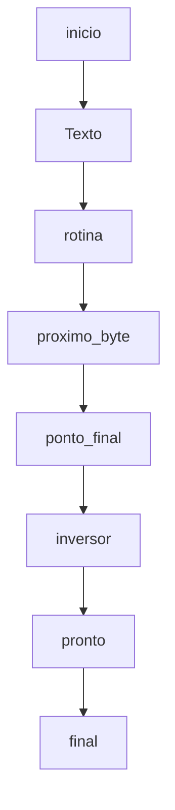

# Conceitos
Alguns conceitos fundamentais para programação em Assembly e em muitas outras linguagens de programação. Eles permitem que os programas executem tarefas complexas de maneira estruturada. Durante muito tempo todos os programas foram escritos seguindo exclusivamente essa lógica, hoje, para linguagens de alto nível, paradgmas como Orientação a Objetos ou Orientação a Eventos são mais utilizados e mais efetivos, ainda assim, em algum momento um "procedimento" é criado em seu código.
## Programação Procedural
A programação procedural é um paradigma de programação que se concentra na criação e organização de procedimentos (ou funções) para realizar tarefas específicas. Os procedimentos são blocos de código que podem ser chamados de outros locais do programa para executar uma ação específica.
### Estruturas de Decisão
As estruturas de decisão permitem que um programa tome diferentes caminhos de execução com base em condições específicas. Em Assembly, as estruturas de decisão são geralmente implementadas usando instruções de comparação (cmp) e instruções de salto condicional (jmp).
### Estruturas de Repetição (Loops):
As estruturas de repetição permitem que um bloco de código seja executado repetidamente enquanto uma condição for verdadeira. Em Assembly, os loops são implementados comumente usando um rótulo e instruções de salto condicional (jmp).
# inversor
```
name "inversor"
org 100h
jmp rotina
texto db '!oditrevni otxeT$'
rotina:
    lea bx, texto   
    mov si, bx      
proximo_byte:
    cmp [si], '$' 
    je ponto_final
    inc si
    jmp proximo_byte
ponto_final:
    dec si  
inversor:
    cmp bx, si
    jae pronto
    mov al, [bx]
    mov ah, [si]
    mov [si], al
    mov [bx], ah
    inc bx
    dec si
    jmp inversor
pronto
    lea dx, texto
    mov ah, 09h
    int 21h
    mov ah, 0
    int 16h
ret
```
O programa "inversor" é um pouco mais avançado do que o programa "hi". Enquanto o programa "hi" simplesmente imprime uma mensagem na tela, o programa "inversor" realiza uma tarefa mais complexa: inverter uma string.

## Como funciona
1. **Nome e Origem do Programa:**
```
name "inversor"
org 100h
```
Assim como no programa "hi", começamos definindo o nome do programa como "inversor" e especificamos o ponto de origem do programa.
2. **Declaração da String a Ser Invertida:**
```
texto db '!oditrevni otxeT$'
```
Em seguida, declaramos uma string que queremos inverter. Neste caso, a string é "!oditrevni otxeT$". O cifrão ($) indica o final da string.
3. **Rotina Principal (rotina):**
```
rotina:
    lea bx, texto
    mov si, bx
```
A partir daqui a maior parte da lógica do programa acontece. Começamos carregando o endereço da string na memória para o registrador BX e então movemos esse endereço para o registrador SI.
4. **Loop de Leitura da String (proximo_byte):**
```
proximo_byte:
    cmp [si], '$'
    je ponto_final
    inc si
    jmp proximo_byte
```
Este é um loop que percorre a string até encontrar o final da string (indicado pelo cifrão $). Ele usa o registrador SI para percorrer a string byte a byte.
5. **Inversão da String (inversor):**
```
inversor:
    cmp bx, si
    jae pronto
    mov al, [bx]
    mov ah, [si]
    mov [si], al
    mov [bx], ah
    inc bx
    dec si
    jmp inversor
```
Após encontrar o final da string, entramos em um novo loop para inverter a string. Este loop compara os registradores BX e SI para determinar quando chegamos ao meio da string. Então, ele troca os bytes na posição atual de BX e SI até que a string esteja completamente invertida.
6. **Impressão da String Invertida:**
```
pronto:
    lea dx, texto
    mov ah, 09h
    int 21h
```
Depois que a string é invertida, a instrução int 21h é usada para chamar a interrupção do DOS e imprimir a string invertida na tela.
7. **Espera por uma Tecla Pressionada:**
```
pronto:
    mov ah, 0
    int 16h
    ret
```
Finalmente, o programa espera por qualquer tecla ser pressionada antes de retornar ao sistema operacional.

Em resumo, o programa "inversor" é um exemplo de como você pode manipular strings em Assembly. Ele mostra como usar loops, registros e operações de manipulação de strings para realizar uma tarefa mais complexa do que simplesmente imprimir uma mensagem na tela.
<!--
## Veja a lógica

-->
<!-- Referências sobre diagramas https://mermaid.js.org/syntax/flowchart.html https://docs.github.com/pt/get-started/writing-on-github/working-with-advanced-formatting/creating-diagrams#creating-mermaid-diagrams -->


